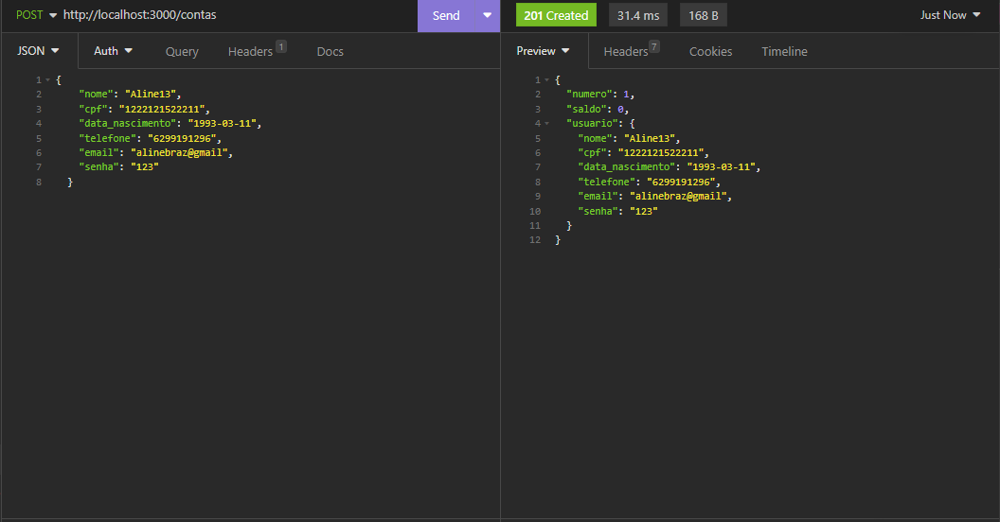

# API Banco Digital Cubos

### Descrição do Projeto

Este projeto é uma API RESTful para um Banco Digital, desenvolvido como parte do desafio do Módulo 2 no curso de desenvolvimento web da Cubos Academy. A API permite a criação de contas bancárias, atualização de dados do usuário, depósitos, saques, transferências, consulta de saldo e extrato, além da exclusão de contas bancárias. Os dados são persistidos em memória em um objeto JavaScript.

### Tecnologias Utilizadas

Node.js
Express.js

### Endpoints

- `GET /contas?senha_banco=123`: Lista todas as contas bancárias existentes.
- `POST /contas`: Cria uma nova conta bancária.
- `PUT /contas/:numeroConta/usuario`: Atualiza os dados do usuário de uma conta bancária.
- `DELETE /contas/:numeroConta`: Exclui uma conta bancária.
- `POST /transacoes/depositar`: Realiza um depósito em uma conta bancária.
- `POST /transacoes/sacar`: Realiza um saque de uma conta bancária.
- `POST /transacoes/transferir`: Realiza uma transferência entre contas bancárias.
- `GET /contas/saldo?numero_conta=123&senha=123`: Consulta o saldo de uma conta bancária.
- `GET /contas/extrato?numero_conta=123&senha=123`: Emite o extrato de uma conta bancária.

### Status Codes
  Os status codes esperados como resposta da API serão 200 (requisição bem sucedida), 201 (requisição bem sucedida e algo foi criado), 400 (o servidor não entendeu a requisição pois está com uma sintaxe/formato inválido) e 404 (o servidor não pode encontrar o recurso solicitado).

 
